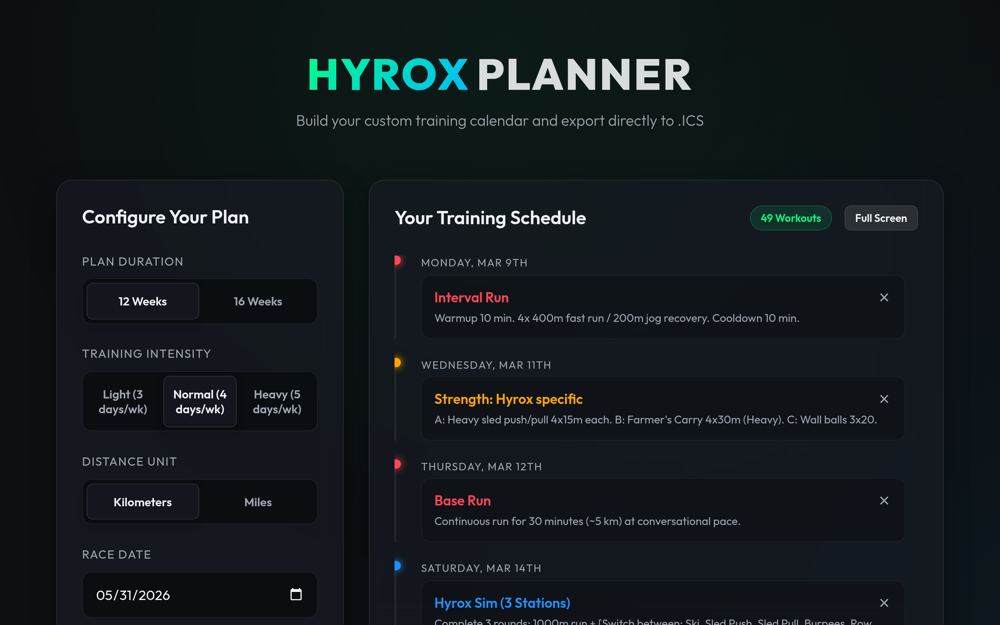

[Home](/index.md) / [Projects](/projects/index.md)

---

title: Hyrox Training Plan
tags:

- project
- web
- fitness

---

# Hyrox Training Plan

A web application that generates training plans for Hyrox races.

## About the Project

This project provides a customizable 12-week training plan for athletes preparing for a Hyrox competition. It allows users to adjust their starting volume, set race dates, and choose their preferred distance units.

## Links

- **Website:** [https://training.deanw.dev](https://training.deanw.dev)
- **Source Code:** [https://github.com/deankiwi/training-plan-for-hyrox](https://github.com/deankiwi/training-plan-for-hyrox) (Local Folder: `/Users/deanwelchmain/github/deankiwi/training-plan-for-hyrox`)
